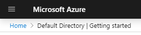

# BlazorAAD
I take lots of notes for myself on how to replicate something, because it might be 3-6 months, or years before I come back to repeat something. 
This is a practice I started doing nearly 40 years ago. 
With Github, I can share, and do so here.  Improvements welcome
  
This is Blazor Azure Active Directory example program built following the documentation.
Because the documentation is scattered about in Azure, Visual Studio, and Blazor A&A subjects, I've tried to bring all that into one place.

## My Notes
* Sarted with https://docs.microsoft.com/en-us/aspnet/core/security/blazor/?view=aspnetcore-3.1 

* Then followed this link  
 to https://docs.microsoft.com/en-us/aspnet/core/security/blazor/server?view=aspnetcore-3.1&tabs=visual-studio 

* This is an interesting doc https://docs.microsoft.com/en-us/samples/azure-samples/active-directory-aspnetcore-webapp-openidconnect-v2/enable-webapp-signin/?view=aspnetcore-3.1 

* Somewhere there is a doc that starts with building project, pauses, builds AD tenant, and then comes back to VS.  Can't find it.  Will go by memory. (that is dangerous.) 

### Azure Active Directory Setup
* Login to Azure Portal 
* Create Free account if you need to for testing 
* Make sure you are in your default directory.  Upper right 
 
* Click on Portal menu, upper left  
  
* Select **Azure Active Directory**  
  
* Getting Started  
  
* Watch the video  
    
* Add a custom domain name  
    
* This should be a real domain name, like example.com  
  
  * Make sure it is yours. 
  * This is an easy part to get wrong.  Wish there was more explanation 
* Back on Default Directory | Getting Started page  
  
* Choose get a free trial for Azure AD Premium  
  
  * Read the info, please. 
* Choose Azure AD Premium P2  
  
* Select Free Trial and Activate  
  
  * I've already got my free account activated, so can't really walk through Next Steps 
* Back on **Default Directory| Overview**  
  
  * Should see custom domain listed under Default Directory  
  

### Visual Studio

* Start Visual Studio 
* Following the instructions  
>   

> 

>   

>   

>   

>   

>   

>  

* Dialog box on right changes:  

* Use the Drop Down to select the custom domain we just created, example.com 
  * Select the correct domain name from the list 
  * Not showing for security reasons. 
  * Double check that AAD showing in the portal is the same selected from you list.  Easy to get wrong 
  * Leave remaining options as they are 
  * Click **OK** 
* Create the App  

* Should now have a completed app 
* **F5** to run it 
* Should end up with a cute little login screen  

* Use a Microsoft account to login 
* Success !

  * Note the Hello message with the account name, signifying authentication 
  * Log out signifies authentication 
  * Lots of customization potential, which I will leave to others. 
* Examining appsettings.json, there is an AzureAD section I don't want to put into the repository.  I'll move this to secrets.json, and retest.  All still works. 
  * Left behind a non-working example .

 